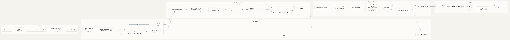
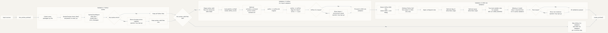

```mermaid
flowchart LR
    A["Input sources"] --> B["iter_archive_entries()"]
    B --> C["Collect every packaged .py file"]

    subgraph V1["Validation 1: Python syntax"]
        C --> D["SyntaxChecker.check_files()<br/>ast.parse() on every .py"]
        D --> E["SyntaxCheckReport<br/>valid_files / invalid_files / error_messages"]
        E --> F{"Any syntax errors?"}
        F -- "No" --> G["Keep all Python files"]
        F -- "Yes" --> F1["Show all syntax errors together<br/>operator may type go"]
        F1 --> G1["Keep syntax-valid files only"]
    end

    G --> H
    G1 --> H
    H{"Any syntax-valid files left?"}
    H -- "No" --> Z["Skip Airflow CLI validation<br/>skip DAG rule validation<br/>go to archive step"]
    H -- "Yes" --> I["Stage syntax-valid files into temporary DAG folder"]

    subgraph V2["Validation 2: Airflow CLI import validation"]
        I --> J["load_pipeline_config()<br/>render airflow_cli.env"]
        J --> K["Optional activation_command<br/>source conda + activate env"]
        K --> L["python -m airflow db migrate"]
        L --> M["python -m airflow dags list-import-errors -l -o json"]
        M --> N{"Airflow CLI issues?"}
        N -- "No" --> O["Proceed to DAG rule validation"]
        N -- "Yes" --> N1["Show import / environment issues<br/>operator may type go"]
        N1 --> O
    end

    subgraph V3["Validation 3: DAG rule validation"]
        O --> P["Detect Airflow DAG files<br/>classic DAG(...) and @dag"]
        P --> P1["Ordinary Python file?<br/>Not subject to DAG-only rules"]
        P1 --> Q["Apply configured rules"]
        Q --> Q1["Optional dag_id allow/deny regex"]
        Q1 --> Q2["Optional queue allow/deny regex"]
        Q2 --> Q3["Top-level variable rules<br/>for example GDT_ET_FEED_SOURCE"]
        Q3 --> Q4["Missing or invalid value is reported here<br/>not in syntax validation"]
        Q4 --> R{"Rule issues?"}
        R -- "No" --> S["All validations passed"]
        R -- "Yes" --> R1["Show rule violations<br/>operator may type go"]
        R1 --> S
    end

    S --> T["create_archive()"]
    Z --> T
```

# package_and_upload_dag.py flowcharts

## 1. Execution flow

Draw.io source:
[package-and-upload-dag-execution-flow.drawio](./package-and-upload-dag-execution-flow.drawio)

Restyled SVG:

Rendered SVG:

Rendered PNG:

Mermaid source:

```mermaid
flowchart LR
    subgraph B0["Bootstrap"]
        A["CLI invocation"] --> B["main()<br/>parse_args()"]
        B --> C["resolve_runtime_logging_settings()"]
        C --> D["ScriptOutputSession<br/>stdout/stderr tee + log retention"]
        D --> E["_run_with_args()"]
    end

    subgraph B1["Step 1-2: initialize and syntax check"]
        E --> F["Resolve credentials<br/>load properties<br/>normalize sources"]
        F --> G["Collect packaged .py files<br/>SyntaxChecker.check_files()"]
        G --> H{"Syntax errors?"}
        H -- "No" --> I["Proceed with all Python files"]
        H -- "Yes" --> H1["Show syntax errors<br/>require operator input: go"]
        H1 -- "go" --> I1["Proceed with syntax-valid files only"]
        H1 -- "Abort" --> Z["Stop without packaging"]
    end

    subgraph B2["Step 3: Airflow CLI validation"]
        I --> J
        I1 --> J
        J["run_airflow_dag_validation()"] --> J1["load_pipeline_config()<br/>render_airflow_cli_env()<br/>stage_sources_for_airflow_check()"]
        J1 --> J2["Optionally source / conda activate"]
        J2 --> J3["python -m airflow db migrate"]
        J3 --> J4["python -m airflow dags list-import-errors -l -o json"]
        J4 --> K{"Airflow CLI issues?"}
        K -- "No" --> L["Continue to DAG rule validation"]
        K -- "Yes" --> K1["Show CLI issues<br/>require operator input: go"]
        K1 -- "go" --> L
        K1 -- "Abort" --> Z
    end

    subgraph B3["Step 4: DAG rule validation"]
        L --> M["run_dag_rule_validation()"]
        M --> M1["load_pipeline_config()<br/>stage syntax-valid files"]
        M1 --> M2["RuleChecker.validate()"]
        M2 --> M3["Detect DAG(...) or @dag<br/>apply name_rules / queue_rules / dag_variable_rules"]
        M3 --> N{"Rule issues?"}
        N -- "No" --> O["Continue to packaging"]
        N -- "Yes" --> N1["Show rule issues<br/>require operator input: go"]
        N1 -- "go" --> O
        N1 -- "Abort" --> Z
    end

    subgraph B4["Step 5-6: package and upload"]
        O --> P["create_archive()<br/>calculate SHA256"]
        P --> Q["build_upload_url()"]
        Q --> R{"--dry-run?"}
        R -- "Yes" --> S["Print package summary<br/>print log file paths"]
        R -- "No" --> T["upload_archive()<br/>HTTP PUT to Nexus"]
        T --> S
    end
```

## 2. Validation flow

Draw.io source:
[package-and-upload-dag-validation-flow.drawio](./package-and-upload-dag-validation-flow.drawio)

Restyled SVG:

Rendered SVG:

Rendered PNG:

Mermaid source:

